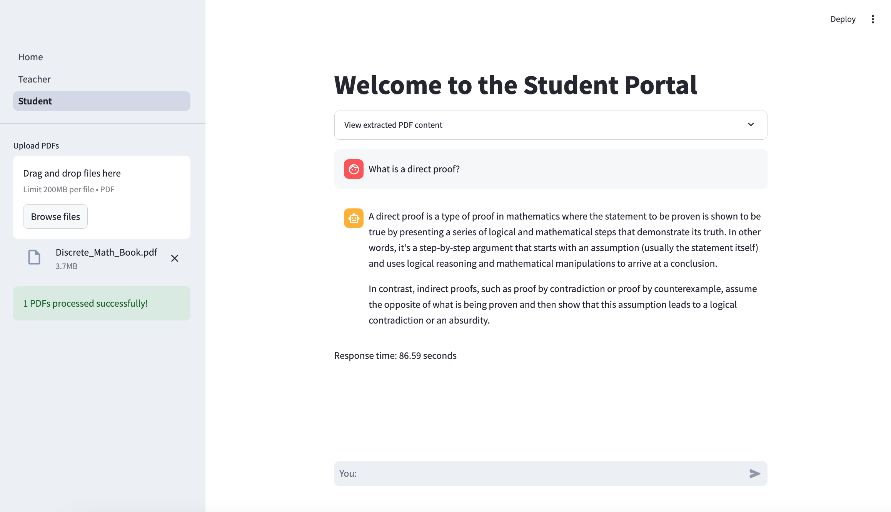

# picaTA Streamlit

**PicaTA** is an interactive teaching assistant tool for instructors and students, designed to support peer instruction (PI) and continuous assessment (CA) integration. The platform helps instructors manage courses, track student progress, and facilitate personalized student learning in discrete mathematics and algorithms.

## Features

### Teacher Portal
- **Create Partners**: Generate partners for quizzes.
- **View Grades**: Review and analyze student performance.
- **Add Points**: Update scores based on assessments.

### Student Portal
- **Provide Interactive Help**: Ask PicaTA questions about course material or your coursework.
- **Step-by-Step Guidance**: Receive detailed explanations to enhance your understanding at your own pace.



## Installation

1. **Clone the Repository**:
    ```bash
    git clone <repository_url>
    cd <repository_name>
    ```

2. **Set Up the Virtual Environment**:
    ```bash
    python3 -m venv .venv
    source .venv/bin/activate  # For macOS/Linux
    ```

3. **Install Dependencies**:
    ```bash
    pip install -r requirements.txt
    ```

4. **Set Up Environment Variables**:
    1. Create file `set_env.sh`
    - `CANVAS_URL`: Your Canvas API base URL.
    - `CANVAS_TOKEN`: Your Canvas API key.

    2. Run 
    ```bash
    source set_env.sh
    ```
     ```bash
    env
    ```

## Running the App

Start the Streamlit app with the following command:

```bash
streamlit run Home.py
```

## Libraries and Dependencies

- **Streamlit**: Web application framework for displaying interactive elements.
- **Ollama**: Software platform that allows users to run large language models (LLMs) on their local computer.
- **canvasapi**: Python wrapper for the Canvas LMS API.
- **langchain_ollama**: Language model library for interactive question-answering with a conversational AI model.
- **streamlit_option_menu**: Custom sidebar navigation for streamlined access to various features.
- **Pandas**
- **langchain-community**

## Notes
- **Environment Configuration**: Ensure `CANVAS_URL` and `CANVAS_TOKEN` are set as environment variables to use Canvas API functionalities.